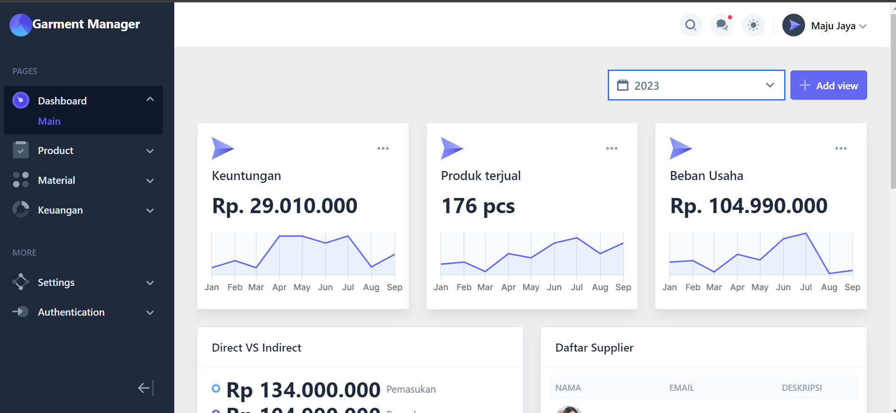
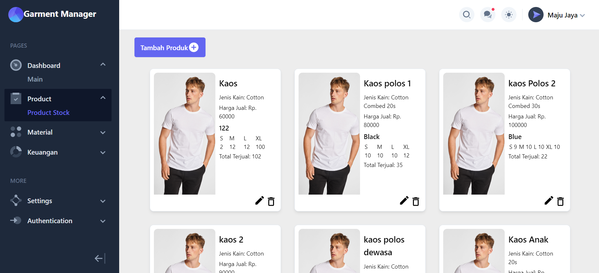
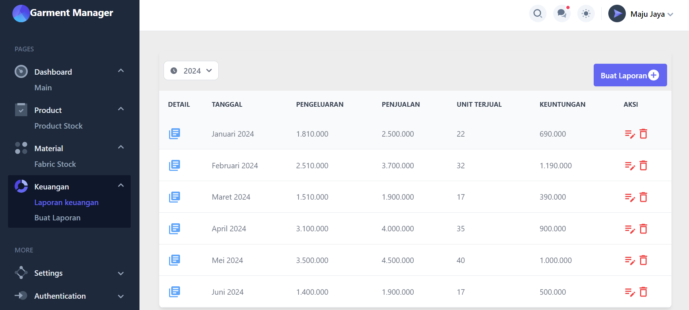

# Garment Manager





## Description

Garment Manager is an application designed to help manage the fashion industry with features such as a dashboard, product management, raw material management, and financial reporting. The application is built using React for the front-end and Express.js for the back-end, with styling provided by Tailwind CSS.

## Repository Link

You can access the project repository [here](https://github.com/adiprasetyaxyz/garment-manager.git).

## Username & Password

Username : admin
password : admin

## Folder Structure

- **Front-end**: `front-end`
- **Back-end**: `back-end`

## Technologies Used

- **Front-end**: React
- **Back-end**: Express.js
- **Styling**: Tailwind CSS

## Features

1. **Dashboard**  
   Displays key data and statistics related to garment management.

2. **Product Management**  
   Features to add, edit, and delete products, as well as view the list of existing products.

3. **Raw Material Management**  
   Manages materials used in production, including adding, editing, and deleting materials.

4. **Financial Reporting**  
   Provides features to generate and view financial reports related to sales and expenses.

## Installation and Usage

### 1. Clone Repository

Clone the project repository using the following command:

```bash
git clone https://github.com/adiprasetyaxyz/garment-manager.git
```

### 2. Back-end Installation

Navigate to the back-end folder:

```bash
cd garment-manager
cd back-end
```

Install dependencies:

```bash
npm install
```

Run the back-end application:

```bash
npm run dev
```

The back-end application will run at http://localhost:3000 (or another configured port).

### 3. Front-end Installation

Navigate to the front-end folder:

```bash
cd garment-manager
cd front-end
```

Change API URL to Back-end URL:
open src/script/config.js
change URL to : http://localhost:3000 (or another configured port)

Install dependencies:

```bash
npm install
```

Run the front-end application:

```bash
npm run dev
```

The front-end application will run at http://localhost:5173 (or another configured port).

## Contributing

If you would like to contribute to this project, please fork the repository and submit a pull request with your changes. Make sure to follow the contribution guidelines.
